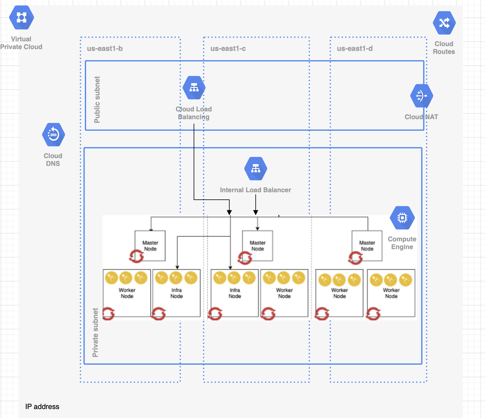

# Automated OpenShift v4 installation on GCP

This project automates the Red Hat Openshift Container Platform 4.2 installation on Google Cloud Platform. It focuses on the Openshift User-provided infrastructure installation (UPI) where end users provide pre-existing infrastructure including VMs, networking, load balancers, DNS configuration etc.

* [Infrastructure Architecture](#infrastructure-architecture)
* [Terraform Automation](#terraform-automation)
* [Installation Procedure](#installation-procedure)
* [Cluster access](#cluster-access)
* [AWS Cloud Provider](#aws-cloud-provider)


## Infrastructure Architecture

For detail on OpenShift UPI, please reference the following:


* [https://docs.openshift.com/container-platform/4.2/installing/installing_gcp_user_infra/installing-gcp-user-infra.html](https://docs.openshift.com/container-platform/4.2/installing/installing_gcp_user_infra/installing-gcp-user-infra.html)
* [https://github.com/openshift/installer/blob/master/docs/user/gcp/install_upi.md](https://github.com/openshift/installer/blob/master/docs/user/gcp/install_upi.md)


The following diagram outlines the infrastructure architecture.


## Terraform Automation

This project uses mainly Terraform as infrastructure management and installation automation driver. All the user provisioned resource are created via the terraform scripts in this project.

### Prerequisites

1. To use Terraform automation, download the Terraform binaries [here](https://www.terraform.io/).

   On MacOS, you can acquire it using [homebrew](brew.sh) using this command:

   ```bash
   brew install terraform
   ```

   We recommend to run Terraform automation from an GCP bastion host because the installation will place the entire OpenShift cluster in a private network where you might not have easy access to validate the cluster installation from your laptop.

   Provision a VM instance (with public and private subnets).
   Install Terraform binary.
   Install git

   ```bash
   sudo yum intall git-all
   git --version
   ```

   Install OpenShift command line `oc` cli:

   ```bash
   wget https://mirror.openshift.com/pub/openshift-v4/clients/ocp/latest/openshift-client-linux-4.x.xx.tar.gz
   tar -xvf openshift-client-linux-4.x.xx.tar.gz
   chmod u+x oc kubectl
   sudo mv oc /usr/local/bin
   sudo mv kubectl /usr/local/bin
   oc version
   ```

   You'll also need the [gcloud CLI](https://cloud.google.com/sdk/gcloud/) to do this.

2. Get the Terraform code

   ```bash
   git clone https://github.com/ibm-cloud-architecture/terraform-openshift4-gcp.git
   ```

3. Prepare the DNS

   OpenShift requires a valid DNS domain, you can get one from Cloud DNS or using existing domain and registrar.


4. Prepare GCP Account Access

   Please reference the [Required GCP Infrastructure components](https://docs.openshift.com/container-platform/4.2/installing/installing_gcp/installing-gcp-account.html) to setup your GCP account before installing OpenShift 4.

   We suggest to create an GCP IAM user dedicated for OpenShift installation with permissions documented above.
   On the bastion host, configure your GCP user credential as environment variables:

[PLACEHOLDER]

## Installation Procedure

This project installs the OpenShift 4 in several stages where each stage automates the provisioning of different components from infrastructure to OpenShift installation. The design is to provide the flexibility of different topology and infrastructure requirement.

1. The deployment assumes that you run the terraform deployment from a Linux based environment. This can be performed on an GCP VM linux instance. The deployment machine has the following requirements:

    - git cli
    - terraform 0.12 or later
    - gcloud client
    - jq command
    - wget command

2. Deploy the private network and OpenShift 4 cluster through the connection using transit gateway to the public environment.
   You can use all the automation in a single deployment or you can use the individual folder in the git repository sequentially. The folders are:

 	- 1_private_network: Create the VPC and subnets for the OpenShift cluster
	- 2_load_balancer: Create the system loadbalancer for the API and machine config operator
	- 3_dns: generate a private hosted zone using route 53
	- 4_security_group: defines network access rules for masters and workers
	- 5_iam: define AWS authorities for the masters and workers
	- 6_bootstrap: main module to provision the bootstrap node and generates OpenShift installation files and resources
	- 7_control_plane: create master nodes manually (UPI)
	- 8_postinstall: defines public DNS for application load balancer (optional)

	You can also provision all the components in a single terraform main module, to do that, you need to use a terraform.tfvars, that is copied from the terraform.tfvars.example file. The variables related to that are:

	Create a `terraform.tfvars` file with following content:

  ```
[PLACEHOLDER]
 ```

|name | required | description and value        |
|----------------|------------|--------------|


Initialize the Terraform:

```bash
terraform init
```

Run the terraform provisioning:

```bash
terraform plan
terraform apply
```